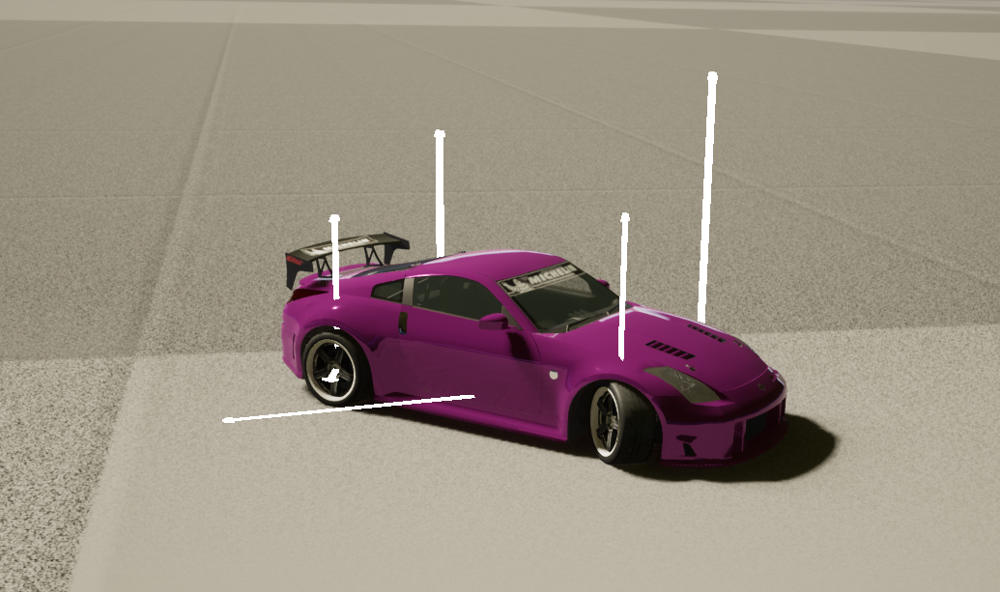
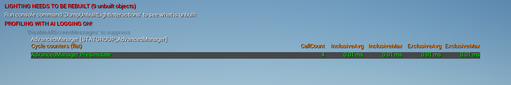

# Advanced Physics Tick

<div align="center">

</div>

Плагин Advanced Physics Tick для Unreal Engine 5 упрощает работу с асинхронной физикой Chaos, обеспечивающий улучшенный контроль над физическим моделированием.

# Основные возможности

* Поддержка асинхронной физики: Легкая интеграция и управление асинхронными вычислениями физики для повышения производительности и реализма.
* Удобный интерфейс: Простые в использовании Blueprint функции.
* Инструменты отладки: Визуализация и логирование для упрощения решения проблем, связанных с физикой.

## Установка

* Клонируйте или скачайте репозиторий.
* Поместите папку плагина в каталог плагинов вашего проекта Unreal Engine 5.
* Запустите редактор.

## Информация

### 1. Добавление силы к компоненту

Используйте функцию `AddForce`, чтобы применить силу к компоненту с включенной физикой:
```
UFUNCTION(BlueprintCallable, Category = "AdvancedTick|Physics")
void AddForce(const UPrimitiveComponent* InComponent, FVector InForce, bool bAccelChange = false);
```
#### Параметры:
-   `InComponent`: Компонент, к которому будет применена сила с bSimulatePhysics = true.
-   `InForce`: Вектор силы.

	> ПРИМЕЧАНИЕ. Используйте в эту функцию только в AdvancedTick или TickAsync, чтобы обеспечить безопасность потока.

Этот пункт применим ко всем остальными функциями `AddForceAtLocation`, `AddTorque` и т.д.

### 2. Метод TickAsync

Вы можете переопределить `TickAsync` в своем классе для расширенной физики логики:

```
virtual void TickAsync(float DeltaTime, float SimTime) override;
```
#### Параметры:
-   `DeltaTime`: Дельта времени.
-   `SimTime`: Текущее время моделирования.

## Консольные команды

-   Включение визуализации сил виде стрелок.
    ```
    p.AdvancedPawn.DrawDebugAllForces 1
    ```
    
-   Настройка размера стрелок, по умолчанию 0.005f
    ```
    p.AdvancedPawn.DrawDebugLinesSize
    ```
    
<div align="center">

</div>

### Стат команды

Мониторинг вызовов функций

```
stat AdvancedManager
```

<div align="center">

</div>

## Поиск неисправностей

* **Thread Safety:** Использование IsGameThread() для FRigidBodyHandle_Internal не является хорошим решением
* Отсутствие Input и Output ChaosSimCallback
